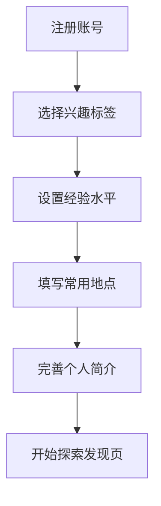
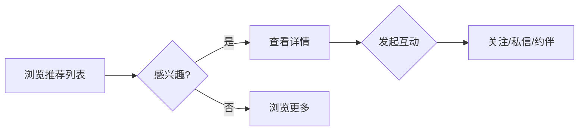
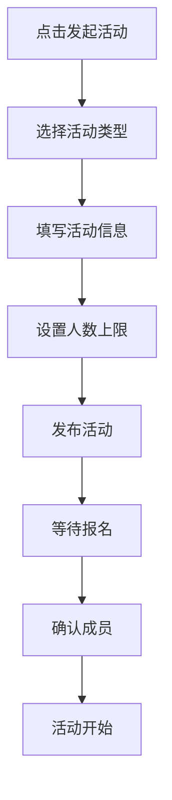

# 小众爱好匹配应用 - 产品需求文档

## 1. 产品概述

「**同趣**」是一款专为冷门兴趣爱好者设计的移动社交应用，帮助观鸟、拼模型、独立电影、旧书交换、城市速写等小众爱好者在身边找到志同道合的伙伴。应用通过兴趣标签匹配、地理位置发现、活动组织、作品展示等功能，将分散的小众圈子聚合起来，让每一次相遇都充满惊喜。

### 产品愿景

成为小众爱好者不可或缺的"灵魂伴侣发现器"，不仅是工具，更是一个有温度、有质感、有深度的兴趣社区。

### 目标用户

- 18-40岁，对小众文化有浓厚兴趣的都市人群
- 愿意投入时间和精力培养冷门爱好
- 希望找到真实、有深度的兴趣交流，不满足于泛泛的社交

---

## 2. 核心功能模块

### 2.1 用户角色

| 角色 | 注册方式 | 核心权限 |
|------|---------|---------|
| 普通用户 | 手机号/邮箱注册 | 浏览、匹配、发活动、发动态、社交 |
| 认证爱好者 | 提交资质证明 | 优先展示、发起大型活动、组织者认证 |

### 2.2 功能架构

#### 2.2.1 兴趣库管理
- **兴趣标签系统**：支持建立多个兴趣标签，每个标签包含：
  - 兴趣类型（观鸟、模型、电影等）
  - 经验阶段（新手/进阶/达人）
  - 常用地点（地理位置）
  - 可分享资源（设备、书籍、材料等）
  - 希望交流方式（线下/线上/混合）
- **兴趣匹配度算法**：基于兴趣重叠度、距离、活跃时间计算匹配分数

#### 2.2.2 同好地图
- **附近活跃点**：展示500m-10km范围内同好聚集地
- **近期活动标记**：地图上显示即将举办的活动位置
- **热力图显示**：显示兴趣活跃区域分布
- **筛选功能**：按兴趣类型、活动类型、时间范围筛选

#### 2.2.3 匹配详情
- **智能推荐列表**：基于兴趣匹配度推荐同好
- **深度筛选**：按经验水平、资源类型、交流方式筛选
- **匹配详情页**：展示对方兴趣、经历、资源、可分享内容
- **关注功能**：关注感兴趣的同好，接收动态更新

#### 2.2.4 约伴活动系统
- **一对一约练**：
  - 发起约练请求
  - 选择时间地点
  - 确认后建立会话
- **小组活动（3-5人）**：
  - 创建活动（主题、时间、地点、人数上限）
  - 成员申请与确认机制
  - 活动提醒与日历集成
- **活动管理**：
  - 活动状态（报名中/已确认/进行中/已完成）
  - 成员确认（需要全员确认才算正式成局）
  - 候补名单管理

#### 2.2.5 作品墙
- **动态发布**：发布作品照片、心得笔记、经验分享
- **物品交换清单**：建立个人可交换物品列表
- **评论互动**：对作品进行点评交流
- **收藏与转发**：收藏喜欢的作品，转发到其他平台

#### 2.2.6 社交互动
- **私信破冰**：发起私信聊天，支持表情、图片
- **屏蔽打扰**：屏蔽/拉黑功能，还你清净
- **活动评价**：活动结束后互评，建立信任体系
- **长期同好关注**：关注后持续接收对方动态更新

---

## 3. 页面结构

### 3.1 主要页面

| 页面名称 | 核心模块 | 功能描述 |
|---------|---------|---------|
| **首页/发现** | 推荐同好、附近活动、热门兴趣 | 个性化内容推荐，快速发现同好 |
| **地图页** | 同好地图、活动标记、筛选 | 地理位置发现附近资源和活动 |
| **活动页** | 活动列表、发起活动、我的活动 | 浏览和创建约伴活动 |
| **作品墙** | 动态流、作品展示、交换清单 | 发现和分享兴趣作品 |
| **消息页** | 会话列表、私信、系统通知 | 社交互动中心 |
| **个人主页** | 兴趣标签、个人资料、资源展示 | 展示自我，管理兴趣和设置 |

### 3.2 页面层级

```
底部导航 (5个Tab)
├── 发现页
│   ├── 推荐同好列表
│   ├── 附近活动卡片
│   └── 热门兴趣标签
│
├── 地图页
│   ├── 地图视图（标记点、热力图）
│   ├── 活动详情页
│   └── 同好详情页
│
├── 活动页
│   ├── 活动列表（全部/我的）
│   ├── 创建活动页
│   ├── 活动详情页
│   └── 活动评价页
│
├── 作品墙
│   ├── 作品流
│   ├── 发布动态页
│   ├── 物品交换清单
│   └── 作品详情页
│
└── 我的页
    ├── 个人资料编辑
    ├── 兴趣标签管理
    ├── 关注列表
    ├── 设置页
    └── 屏蔽管理
```

---

## 4. 核心流程

### 4.1 用户首次使用流程



### 4.2 发现同好流程



### 4.3 发起活动流程



---

## 5. 用户界面设计

### 5.1 设计风格

**设计理念：温暖的复古书店氛围 × 现代简约交互**

- **整体感觉**：像走进一家有品味的独立书店，温暖、质朴、有深度
- **视觉基调**：大地色系为主，搭配森林绿和暖橙点缀
- **质感追求**：有手工感的元素（手绘图标、纸张纹理、墨水印记）

### 5.2 配色方案

```css
:root {
  /* 主色调 - 温暖的大地色 */
  --color-primary: #8B5A3C;      /* 深棕 */
  --color-secondary: #D4A574;    /* 浅驼色 */
  --color-accent: #2D5A4A;       /* 森林绿 */
  --color-highlight: #E07B4C;    /* 暖橙 */
  
  /* 中性色 */
  --color-bg-primary: #FAF7F2;   /* 米白背景 */
  --color-bg-secondary: #F0EBE3; /* 浅米色卡片 */
  --color-bg-tertiary: #E8E2D9;  /* 分割线背景 */
  
  /* 文字色 */
  --color-text-primary: #2C2416;   /* 深棕文字 */
  --color-text-secondary: #6B5D4D; /* 次要文字 */
  --color-text-muted: #9B8B7A;     /* 辅助文字 */
  
  /* 功能色 */
  --color-success: #4A7C59;      /* 成功绿 */
  --color-warning: #C17F4E;      /* 警告橙 */
  --color-error: #A65D57;        /* 错误红 */
}
```

### 5.3 字体系统

```css
/* 标题字体 - 有质感的衬线体 */
--font-display: 'Noto Serif SC', 'Source Han Serif CN', serif;

/* 正文字体 - 清晰的无衬线体 */
--font-body: 'Noto Sans SC', -apple-system, BlinkMacSystemFont, sans-serif;

/* 辅助字体 - 用于标签和强调 */
--font-accent: 'Ma Shan Zheng', cursive;  /* 手写风格 */
```

### 5.4 组件风格

- **卡片设计**：
  - 圆角：12px-16px（柔和但不过于圆润）
  - 阴影：柔和的暖色阴影
  - 背景：微妙的纸张纹理
  - 边框：1px solid rgba(139, 90, 60, 0.1)

- **按钮风格**：
  - 主按钮：深棕背景 + 米白文字，hover时轻微上浮
  - 次按钮：透明背景 + 森林绿边框
  - 圆角：24px（胶囊形状）
  - 过渡动画：150ms ease-out

- **图标风格**：
  - 手绘线条图标
  - 2px描边
  - 圆角端点
  - 森林绿色或深棕色

- **头像设计**：
  - 圆形或圆角方形
  - 柔和的边框
  - 可选的兴趣标签徽章

### 5.5 交互动效

- **页面切换**：平滑的滑入/滑出效果，300ms
- **卡片加载**：交错淡入效果，每个卡片延迟100ms
- **按钮反馈**：按下时轻微缩放(0.96)，抬起时回弹
- **下拉刷新**：弹性下拉效果
- **地图标记**：脉冲动画表示活跃度

---

## 6. 页面详细设计

### 6.1 首页/发现页

**设计要点**：
- 顶部搜索栏 + 筛选入口
- 兴趣推荐区（横向滚动卡片）
- 推荐同好列表（垂直排列）
- 附近活动卡片（带地图缩略图）
- 浮动"发起活动"按钮

**视觉元素**：
- 背景：淡米色渐变
- 卡片：米白背景 + 微妙阴影
- 头像：圆形 + 经验徽章
- 标签：胶囊形状 + 森林绿背景

### 6.2 同好地图页

**设计要点**：
- 全屏地图（支持缩放）
- 底部抽屉展示列表
- 地图标记（兴趣图标 + 人数）
- 筛选浮动面板
- 热力图层切换

**视觉元素**：
- 地图样式：浅色调自定义地图
- 标记点：手绘风格图标
- 气泡：圆角卡片样式
- 当前定位：脉冲动画

### 6.3 活动详情页

**设计要点**：
- 活动封面大图
- 活动基本信息（时间、地点、人数）
- 发起人信息
- 参与成员头像列表
- 活动描述
- 报名/取消按钮
- 活动评价入口

**视觉元素**：
- 封面：圆角矩形 + 渐变遮罩
- 信息卡片：纸张纹理背景
- 成员展示：头像重叠效果
- 按钮：胶囊形状 + 图标

### 6.4 作品墙页

**设计要点**：
- 瀑布流布局
- 图片/心得卡片
- 作品类型标签
- 互动按钮（点赞、评论、收藏）
- 发布入口（右下角浮动按钮）

**视觉元素**：
- 瀑布流：2列布局
- 卡片：图片 + 文字 + 作者信息
- 标签：彩色胶囊
- 互动栏：图标 + 数字

### 6.5 个人主页

**设计要点**：
- 头像 + 昵称 + 简介
- 兴趣标签展示（可编辑）
- 数据统计（活动数、关注数、作品数）
- 作品精选（3张网格）
- 编辑入口
- 设置入口

**视觉元素**：
- 头部：渐变背景 + 头像
- 标签：多彩胶囊
- 数据：图标 + 数字
- 作品：圆角网格

---

## 7. 响应式设计

### 7.1 移动端优先

- 设计基于375px宽度
- 适配375px-428px
- 最大内容宽度428px
- 触控友好的按钮尺寸（最小44px）
- 适当的间距（16px基准）

### 7.2 适配要点

- 文字大小根据屏幕宽度缩放
- 图片使用响应式srcset
- 地图手势操作优化
- 长列表虚拟滚动
- 图片懒加载

---

## 8. 性能优化目标

- 首屏加载时间：< 2秒
- 页面切换动画：60fps
- 地图加载：< 3秒
- 列表滚动：无卡顿
- 离线体验：缓存核心数据

---

## 9. 产品特色

### 9.1 差异化亮点

1. **兴趣深度匹配**：不仅看兴趣相同，还看深度、资源、风格是否匹配
2. **真实线下连接**：强调面对面交流，不是纯粹的线上社交
3. **物品交换系统**：创新的资源流通机制
4. **信任评价体系**：活动后的双向评价，建立长期信任
5. **小众优先策略**：推荐算法倾向于服务长尾兴趣

### 9.2 用户成长体系

- **新手期**：完善资料、添加兴趣标签
- **成长期**：发起活动、参与活动、发布作品
- **活跃期**：建立影响力、组织大型活动
- **核心用户**：认证达人、推荐算法加权

---

## 10. 产品路线图

### 第一期（MVP）
- 用户注册和资料管理
- 兴趣标签系统
- 推荐同好列表
- 基础活动功能
- 私信聊天

### 第二期
- 同好地图
- 物品交换清单
- 活动评价系统
- 关注功能

### 第三期
- 认证爱好者体系
- 线下活动管理工具
- 兴趣社群
- 数据分析和推荐优化

---

**文档版本**：v1.0  
**最后更新**：2026-06-13  
**产品负责人**：同趣产品团队
