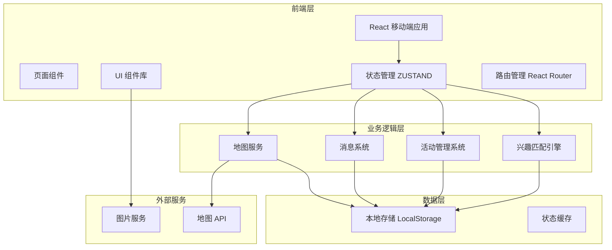
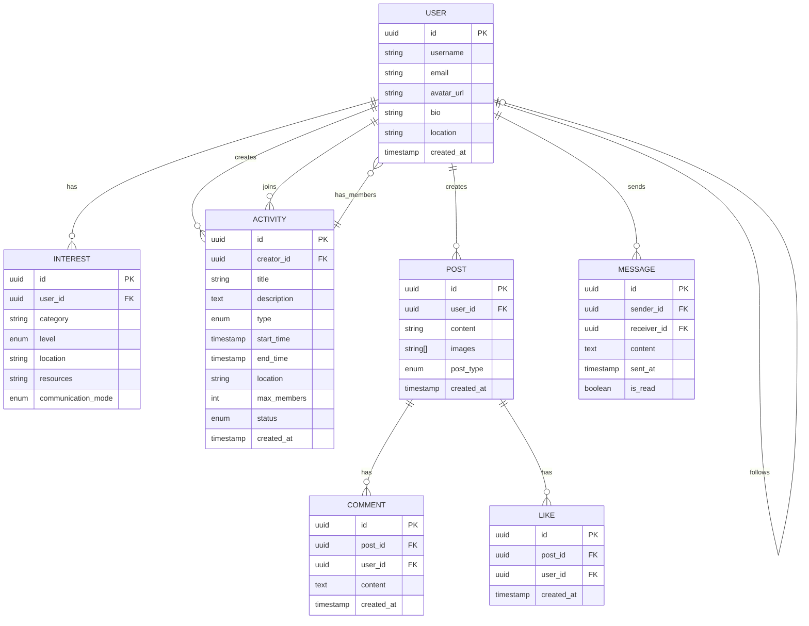

# 同趣 - 小众爱好匹配应用技术架构文档

## 1. 架构设计

### 1.1 系统架构图



### 1.2 技术选型理由

- **React + TypeScript**：类型安全，适合复杂业务逻辑
- **Tailwind CSS**：原子化CSS，快速构建响应式界面
- **Zustand**：轻量级状态管理，适合中大型应用
- **React Router**：SPA路由管理，用户体验流畅
- **高德/腾讯地图SDK**：成熟的地图服务
- **Mock数据模式**：快速验证产品，无需后端依赖

---

## 2. 技术栈详情

### 2.1 核心依赖

```json
{
  "dependencies": {
    "react": "^18.2.0",
    "react-dom": "^18.2.0",
    "react-router-dom": "^6.20.0",
    "zustand": "^4.4.7",
    "lucide-react": "^0.294.0",
    "@react-leaflet/core": "^2.1.0",
    "leaflet": "^1.9.4",
    "react-leaflet": "^4.2.1"
  },
  "devDependencies": {
    "@types/react": "^18.2.43",
    "@types/react-dom": "^18.2.17",
    "@vitejs/plugin-react": "^4.2.1",
    "typescript": "^5.2.2",
    "vite": "^5.0.8",
    "tailwindcss": "^3.3.6",
    "postcss": "^8.4.32",
    "autoprefixer": "^10.4.16"
  }
}
```

### 2.2 项目初始化

使用 `react-ts` 模板，创建步骤：

```bash
# 初始化项目
pnpm create vite-init@latest . --template react-ts --force

# 安装依赖
pnpm install

# 安装额外依赖
pnpm add react-router-dom zustand lucide-react leaflet react-leaflet
pnpm add -D @types/leaflet
```

---

## 3. 路由定义

### 3.1 路由结构

| 路由路径 | 页面名称 | 功能描述 | 访问权限 |
|---------|---------|---------|---------|
| `/` | 首页/发现 | 推荐同好、附近活动 | 需登录 |
| `/map` | 同好地图 | 地图发现附近同好 | 需登录 |
| `/activities` | 活动列表 | 浏览所有活动 | 需登录 |
| `/activities/:id` | 活动详情 | 查看活动详情 | 需登录 |
| `/activities/create` | 创建活动 | 发起新活动 | 需登录 |
| `/wall` | 作品墙 | 浏览作品动态 | 需登录 |
| `/wall/:id` | 作品详情 | 查看作品详情 | 需登录 |
| `/wall/post` | 发布作品 | 发布新动态 | 需登录 |
| `/messages` | 消息中心 | 私信和通知 | 需登录 |
| `/messages/:userId` | 私信会话 | 与用户聊天 | 需登录 |
| `/profile` | 个人主页 | 查看个人资料 | 需登录 |
| `/profile/edit` | 编辑资料 | 修改个人资料 | 需登录 |
| `/profile/interests` | 兴趣管理 | 管理兴趣标签 | 需登录 |
| `/profile/settings` | 设置页 | 应用设置 | 需登录 |
| `/login` | 登录页 | 用户登录 | 公开 |
| `/register` | 注册页 | 用户注册 | 公开 |

### 3.2 路由守卫

```typescript
// 未登录重定向到登录页
const ProtectedRoute: React.FC = ({ children }) => {
  const isAuthenticated = useAuthStore((state) => state.isAuthenticated);
  
  if (!isAuthenticated) {
    return <Navigate to="/login" replace />;
  }
  
  return <>{children}</>;
};
```

---

## 4. 数据模型设计

### 4.1 数据模型定义



### 4.2 TypeScript 类型定义

```typescript
// 用户相关类型
interface User {
  id: string;
  username: string;
  email: string;
  avatar: string;
  bio: string;
  location: string;
  interests: Interest[];
  stats: {
    activitiesCount: number;
    followersCount: number;
    followingCount: number;
    postsCount: number;
  };
  createdAt: string;
}

// 兴趣标签
interface Interest {
  id: string;
  category: string;
  level: '新手' | '进阶' | '达人';
  location: string;
  resources: string[];
  communicationMode: '线下' | '线上' | '混合';
}

// 活动
interface Activity {
  id: string;
  creator: User;
  title: string;
  description: string;
  type: '一对一' | '小组';
  startTime: string;
  endTime: string;
  location: {
    name: string;
    lat: number;
    lng: number;
  };
  maxMembers: number;
  currentMembers: User[];
  status: '报名中' | '已确认' | '进行中' | '已完成';
  createdAt: string;
}

// 作品/动态
interface Post {
  id: string;
  author: User;
  content: string;
  images: string[];
  type: '作品展示' | '心得分享' | '物品交换';
  likes: number;
  comments: Comment[];
  isLiked: boolean;
  isBookmarked: boolean;
  createdAt: string;
}

// 私信消息
interface Message {
  id: string;
  sender: User;
  receiver: User;
  content: string;
  sentAt: string;
  isRead: boolean;
}
```

---

## 5. 状态管理设计

### 5.1 Store 结构

使用 Zustand 进行状态管理，设计以下 store：

```typescript
// 用户认证 Store
interface AuthStore {
  user: User | null;
  isAuthenticated: boolean;
  login: (email: string, password: string) => Promise<void>;
  logout: () => void;
  updateProfile: (data: Partial<User>) => void;
}

// 兴趣管理 Store
interface InterestStore {
  interests: Interest[];
  recommendedUsers: User[];
  addInterest: (interest: Interest) => void;
  removeInterest: (id: string) => void;
  fetchRecommendedUsers: () => Promise<void>;
}

// 活动 Store
interface ActivityStore {
  activities: Activity[];
  currentActivity: Activity | null;
  fetchActivities: () => Promise<void>;
  createActivity: (data: CreateActivityDTO) => Promise<void>;
  joinActivity: (id: string) => Promise<void>;
  leaveActivity: (id: string) => Promise<void>;
}

// 作品墙 Store
interface PostStore {
  posts: Post[];
  currentPost: Post | null;
  fetchPosts: () => Promise<void>;
  createPost: (data: CreatePostDTO) => Promise<void>;
  likePost: (id: string) => Promise<void>;
  bookmarkPost: (id: string) => Promise<void>;
}

// 消息 Store
interface MessageStore {
  conversations: Conversation[];
  currentConversation: Conversation | null;
  unreadCount: number;
  fetchConversations: () => Promise<void>;
  sendMessage: (receiverId: string, content: string) => Promise<void>;
  markAsRead: (conversationId: string) => void;
}
```

### 5.2 本地存储策略

```typescript
// 数据持久化
const useAuthStore = create(
  persist(
    (set, get) => ({
      user: null,
      isAuthenticated: false,
      // ... 其他方法
    }),
    {
      name: 'tongqu-auth',
      storage: createJSONStorage(() => localStorage),
    }
  )
);
```

---

## 6. 组件架构

### 6.1 组件目录结构

```
src/
├── components/
│   ├── common/           # 通用组件
│   │   ├── Button.tsx
│   │   ├── Card.tsx
│   │   ├── Avatar.tsx
│   │   ├── Tag.tsx
│   │   ├── Input.tsx
│   │   ├── Modal.tsx
│   │   └── Skeleton.tsx
│   │
│   ├── activity/          # 活动相关组件
│   │   ├── ActivityCard.tsx
│   │   ├── ActivityList.tsx
│   │   ├── ActivityForm.tsx
│   │   └── ActivityMembers.tsx
│   │
│   ├── post/              # 作品相关组件
│   │   ├── PostCard.tsx
│   │   ├── PostGrid.tsx
│   │   ├── PostDetail.tsx
│   │   └── PostEditor.tsx
│   │
│   ├── map/               # 地图相关组件
│   │   ├── HobbyMap.tsx
│   │   ├── MapMarker.tsx
│   │   └── MapFilter.tsx
│   │
│   ├── user/              # 用户相关组件
│   │   ├── UserCard.tsx
│   │   ├── UserList.tsx
│   │   ├── InterestTags.tsx
│   │   └── ProfileHeader.tsx
│   │
│   └── message/           # 消息相关组件
│       ├── ConversationList.tsx
│       ├── ChatBubble.tsx
│       └── MessageInput.tsx
│
├── pages/                 # 页面组件
│   ├── HomePage.tsx
│   ├── MapPage.tsx
│   ├── ActivitiesPage.tsx
│   ├── ActivityDetailPage.tsx
│   ├── CreateActivityPage.tsx
│   ├── WallPage.tsx
│   ├── PostDetailPage.tsx
│   ├── CreatePostPage.tsx
│   ├── MessagesPage.tsx
│   ├── ChatPage.tsx
│   ├── ProfilePage.tsx
│   ├── EditProfilePage.tsx
│   ├── InterestManagePage.tsx
│   ├── SettingsPage.tsx
│   ├── LoginPage.tsx
│   └── RegisterPage.tsx
│
├── hooks/                 # 自定义 Hooks
│   ├── useAuth.ts
│   ├── useActivities.ts
│   ├── usePosts.ts
│   ├── useMessages.ts
│   └── useMap.ts
│
├── stores/                # Zustand Stores
│   ├── authStore.ts
│   ├── interestStore.ts
│   ├── activityStore.ts
│   ├── postStore.ts
│   └── messageStore.ts
│
├── services/              # 业务逻辑服务
│   ├── matchingService.ts
│   ├── activityService.ts
│   └── mapService.ts
│
├── types/                 # 类型定义
│   └── index.ts
│
├── data/                  # Mock 数据
│   └── mockData.ts
│
└── utils/                 # 工具函数
    ├── dateUtils.ts
    └── locationUtils.ts
```

### 6.2 组件设计原则

1. **单一职责**：每个组件只负责一个功能区域
2. **可复用性**：通用组件抽取到 `common` 目录
3. **受控组件**：使用 React Hook Form 管理表单状态
4. **懒加载**：图片和复杂组件使用懒加载
5. **错误边界**：关键组件包裹错误边界

---

## 7. Mock 数据策略

### 7.1 数据生成原则

- 使用真实感的数据（中文名、地点、活动描述）
- 模拟用户多样性（不同兴趣组合、经验水平）
- 活动状态多样化（进行中、已结束、即将开始）
- 图片使用 Unsplash 的真实图片URL

### 7.2 Mock 数据示例

```typescript
// 模拟用户数据
export const mockUsers: User[] = [
  {
    id: '1',
    username: '林间观鸟人',
    avatar: 'https://images.unsplash.com/photo-1494790108377-be9c29b29330',
    bio: '每周必去一次公园观鸟，记录了超过200种鸟类',
    location: '上海市浦东新区',
    interests: [
      {
        id: '1',
        category: '观鸟',
        level: '达人',
        location: '世纪公园',
        resources: ['单筒望远镜', '鸟类图鉴'],
        communicationMode: '线下'
      }
    ],
    stats: {
      activitiesCount: 45,
      followersCount: 128,
      followingCount: 56,
      postsCount: 89
    }
  },
  // ... 更多用户数据
];

// 模拟活动数据
export const mockActivities: Activity[] = [
  {
    id: '1',
    creator: mockUsers[0],
    title: '周末城市观鸟',
    description: '招募2-3位观鸟爱好者，周末早晨一起去世纪公园观察鸟类，学习鸟类识别技巧。',
    type: '小组',
    startTime: '2026-06-15 08:00',
    endTime: '2026-06-15 11:00',
    location: {
      name: '世纪公园',
      lat: 31.2197,
      lng: 121.5512
    },
    maxMembers: 4,
    currentMembers: [mockUsers[0], mockUsers[1]],
    status: '报名中',
    createdAt: '2026-06-10'
  },
  // ... 更多活动数据
];
```

---

## 8. API 接口设计（预留）

> 当前版本使用 Mock 数据，以下接口设计为后续集成真实后端预留。

### 8.1 用户接口

```
POST   /api/auth/login        # 用户登录
POST   /api/auth/register     # 用户注册
GET    /api/users/:id         # 获取用户信息
PUT    /api/users/:id         # 更新用户信息
GET    /api/users/recommended # 获取推荐用户
POST   /api/users/:id/follow  # 关注用户
DELETE /api/users/:id/follow  # 取消关注
```

### 8.2 活动接口

```
GET    /api/activities              # 获取活动列表
POST   /api/activities              # 创建活动
GET    /api/activities/:id          # 获取活动详情
PUT    /api/activities/:id          # 更新活动
DELETE /api/activities/:id          # 删除活动
POST   /api/activities/:id/join     # 加入活动
POST   /api/activities/:id/leave    # 退出活动
POST   /api/activities/:id/confirm  # 确认成员
```

### 8.3 作品接口

```
GET    /api/posts              # 获取作品列表
POST   /api/posts              # 发布作品
GET    /api/posts/:id          # 获取作品详情
DELETE /api/posts/:id          # 删除作品
POST   /api/posts/:id/like     # 点赞
DELETE /api/posts/:id/like     # 取消点赞
POST   /api/posts/:id/bookmark # 收藏
```

### 8.4 消息接口

```
GET    /api/messages                # 获取会话列表
GET    /api/messages/:userId        # 获取与某用户的聊天记录
POST   /api/messages/:userId        # 发送消息
PUT    /api/messages/:id/read       # 标记已读
POST   /api/users/:id/block         # 屏蔽用户
DELETE /api/users/:id/block         # 取消屏蔽
```

---

## 9. 地图服务集成

### 9.1 地图SDK选择

**高德地图 Web JS SDK** 或 **腾讯地图 WebService API**

优点：
- 中文支持好
- 数据源丰富
- 适合国内用户习惯

### 9.2 功能实现

1. **地图展示**：显示用户位置和标记点
2. **位置搜索**：搜索地点名称
3. **周边查询**：查询附近同好、活动
4. **路线规划**：活动参与者导航
5. **热力图**：兴趣活跃度可视化

### 9.3 Leaflet 集成方案

由于高德/腾讯地图需要申请key，我们使用 Leaflet + OpenStreetMap 作为开发环境：

```typescript
import { MapContainer, TileLayer, Marker, Popup } from 'react-leaflet';
import 'leaflet/dist/leaflet.css';

const HobbyMap: React.FC = () => {
  const center = [31.2304, 121.4737]; // 上海
  
  return (
    <MapContainer center={center} zoom={13}>
      <TileLayer
        url="https://{s}.tile.openstreetmap.org/{z}/{x}/{y}.png"
        attribution='&copy; OpenStreetMap contributors'
      />
      {/* 标记点 */}
    </MapContainer>
  );
};
```

---

## 10. 性能优化策略

### 10.1 图片优化

```typescript
// 使用 srcset 提供不同尺寸图片
const UserAvatar: React.FC<{ user: User }> = ({ user }) => {
  return (
    
  );
};
```

### 10.2 列表虚拟化

```typescript
import { FixedSizeList as List } from 'react-window';

// 长列表使用虚拟滚动
const ActivityList: React.FC<{ activities: Activity[] }> = ({ activities }) => {
  return (
    <List
      height={600}
      itemCount={activities.length}
      itemSize={200}
    >
      {({ index, style }) => (
        <div style={style}>
          <ActivityCard activity={activities[index]} />
        </div>
      )}
    </List>
  );
};
```

### 10.3 代码分割

```typescript
const ProfilePage = lazy(() => import('./pages/ProfilePage'));
const SettingsPage = lazy(() => import('./pages/SettingsPage'));

// 路由中使用
<Route path="/profile" element={<Suspense fallback={<Skeleton />}><ProfilePage /></Suspense>} />
```

---

## 11. 移动端适配

### 11.1 视口设置

```html
<meta name="viewport" content="width=device-width, initial-scale=1.0, maximum-scale=1.0, user-scalable=no" />
```

### 11.2 触控优化

- 按钮最小触控区域：44px × 44px
- 卡片点击区域：整张卡片可点击
- 手势支持：左右滑动删除、下拉刷新
- 防误触：300ms 延迟处理点击事件

### 11.3 性能指标

- 首屏加载：< 2秒
- 交互响应：< 100ms
- 列表滚动：60fps
- 图片加载：渐进式加载

---

## 12. 安全考虑

### 12.1 前端安全

- XSS 防护：React 自动转义 HTML
- CSRF：使用 SameSite Cookie
- 敏感信息：不上传到 localStorage（仅保存在内存）
- HTTPS：生产环境强制使用

### 12.2 用户隐私

- 位置权限：按需申请
- 消息加密：端到端加密（预留）
- 数据删除：用户可注销账号

---

**文档版本**：v1.0  
**最后更新**：2026-06-13  
**技术负责人**：同趣技术团队
